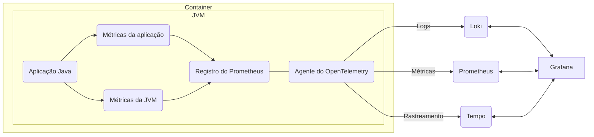

# Java Vanilla com Observabilidade

## Diagrama

```mermaid
flowchart LR
  A(Aplicação Java)
  B(Agente do OpenTelemetry) -- Logs --> D
  B(Agente do OpenTelemetry) -- Métricas --> C
  B(Agente do OpenTelemetry) -- Rastreamento --> E
  C(Prometheus)
  D(Loki)
  E(Tempo)
  F(Registro do Prometheus)
  G(Métricas da JVM)
  H(Métricas da aplicação)

  subgraph Container
    direction TB
    subgraph JVM
      direction TB
        A --> H & G --> F --- B
    end
  end

  D & C & E <---> Grafana
```
