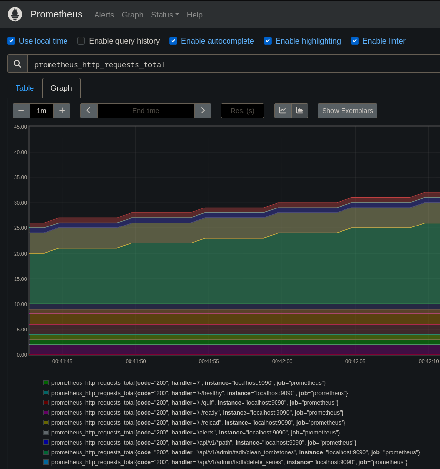
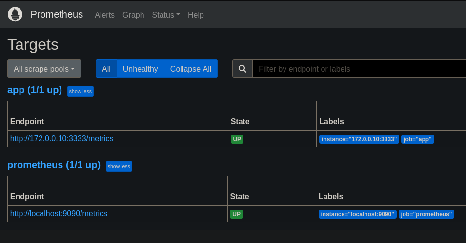
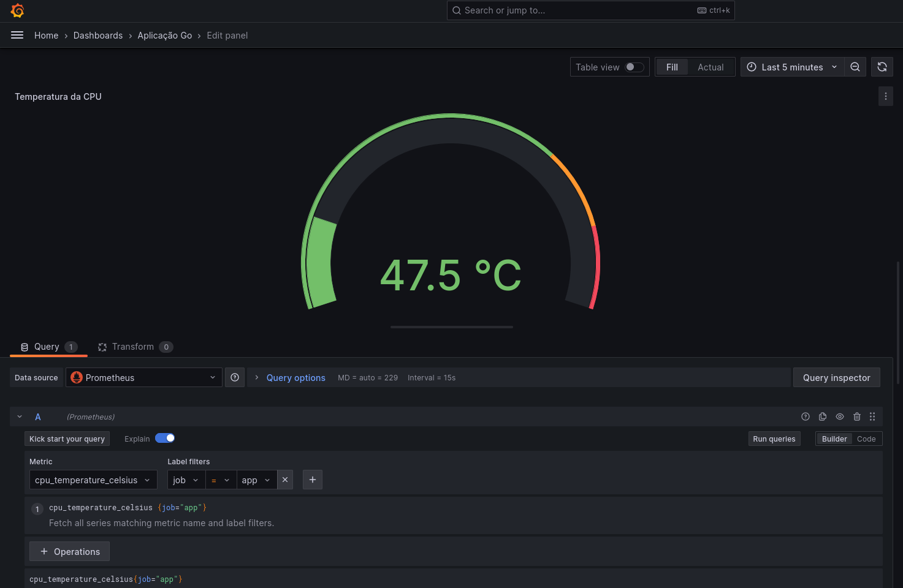
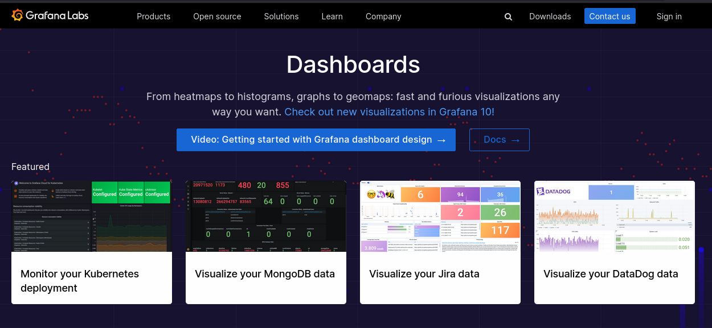
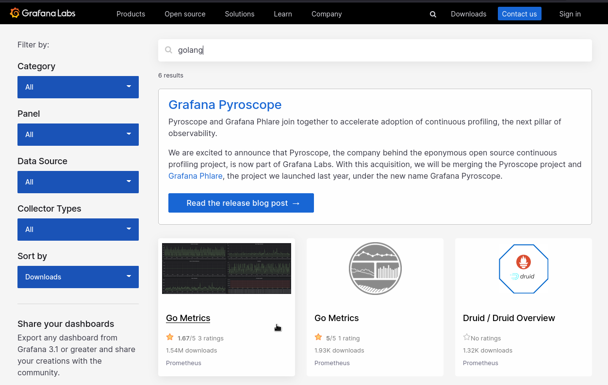
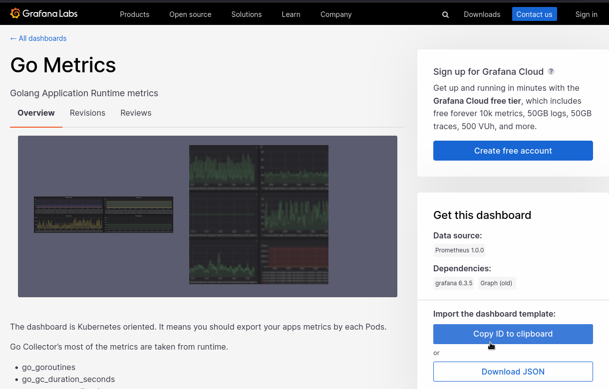
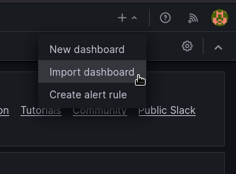
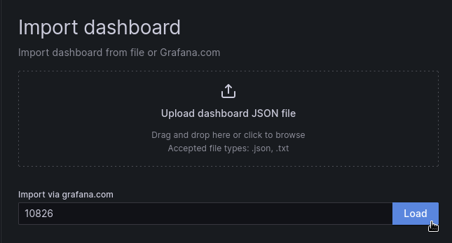
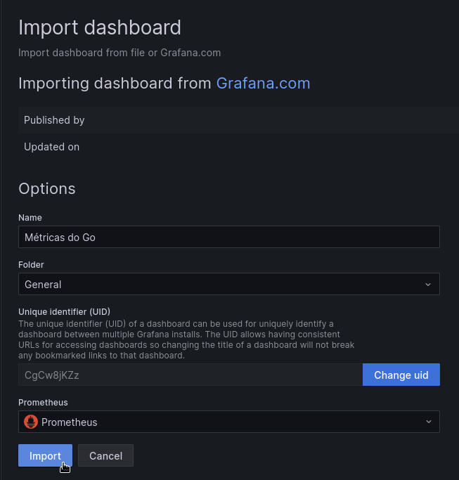
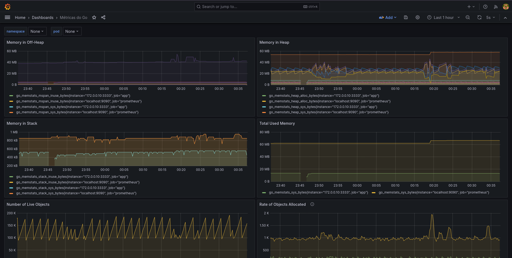

# Prometheus, Grafana e Go

## Descrição

Este repositório demonstra um exemplo de uso do Prometheus para observabilidade de uma aplicação feita em Go

## Pré-requisitos

- **[Docker](https://docs.docker.com/get-docker/)** instalado na máquina com versão mínima em 24.0.x
- **[Golang](https://go.dev/dl/)** instalado na máquina com versão mínima em 1.21.x
- **[Prometheus](https://prometheus.io/download/)** instalado na máquina 2.47.x *(opcional)*
- **[Grafana](https://grafana.com/grafana/download?pg=get&plcmt=selfmanaged-box1-cta1)** instalado na máquina 10.x.x *(opcional)*

## Instruções de uso

### 1. Suba os containers

```bash
docker-compose up -d
```

**Lembrete:** as ferramentas estarão disponíveis nos seguintes endereços abaixo:

> **Aplicação**: [localhost:3333](http://localhost:3333)
<br>
> **Prometheus UI**: [localhost:9090](http://localhost:9090)
<br>
> **Grafana**: [localhost:3000](http://localhost:3000)

### 2. Execute a seguinte expressão no Prometheus UI

```text
prometheus_http_requests_total
```

> **Dica:** você pode trocar para tabela *Graph* para visualizar gráficos

  

### 3. Navegue até ***Status > Targets*** e verifique o status das aplicações

  

### 4. Acesse o painel do Grafana

  

> **Dica:** o usuário e senha padrão é ***admin***

### 5. Crie um medidor para temperatura da CPU

  

### 6. Importe painéis personalizados

#### 6.1 Acesse o [marketplace](https://grafana.com/grafana/dashboards/) de painéis do Grafana

  

#### 6.2 Pesquise por linguagens ou ferramentas

  

#### 6.3 Copie o ID do painel escolhido

  

#### 6.4 Importe o painel para o Grafana

  

#### 6.5 Cole o ID do painel para carregamento

  

  

  
