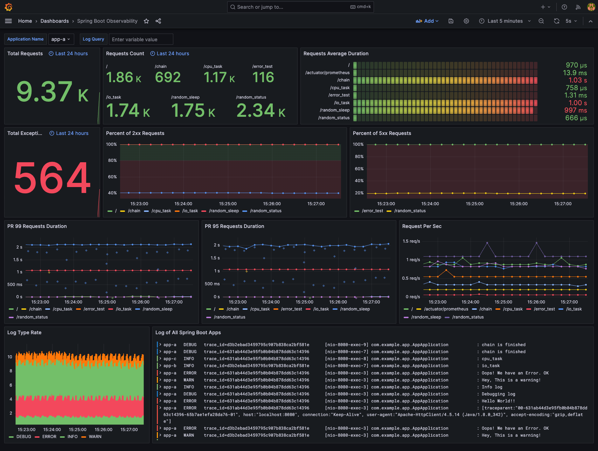
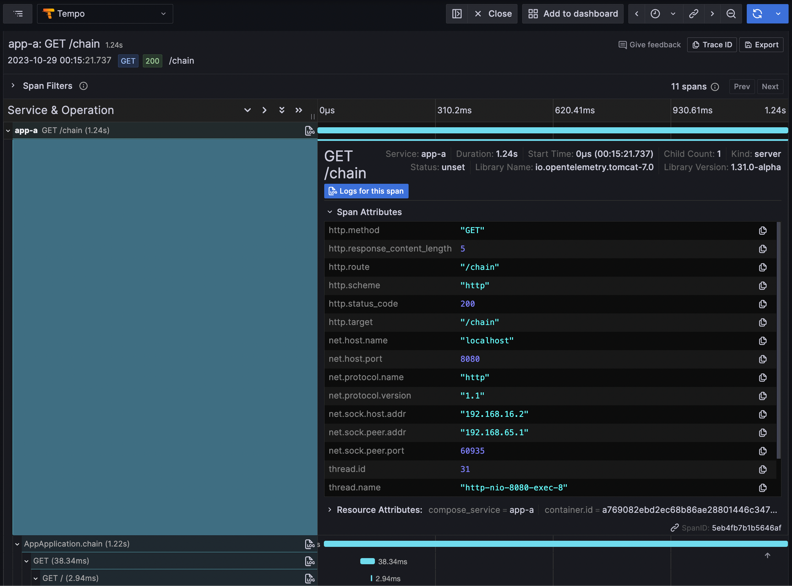
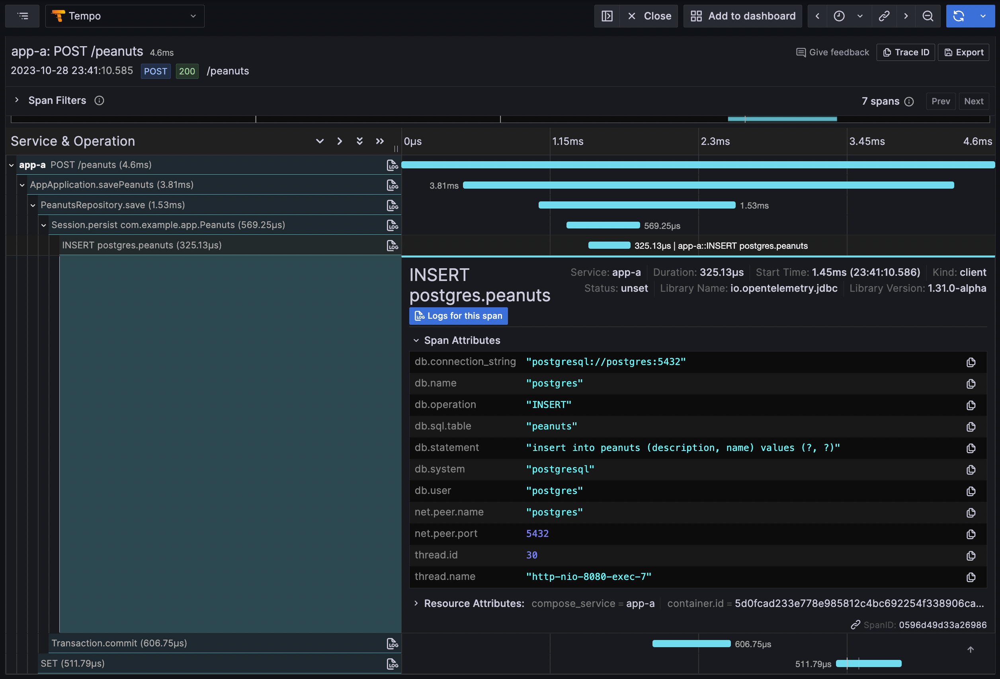
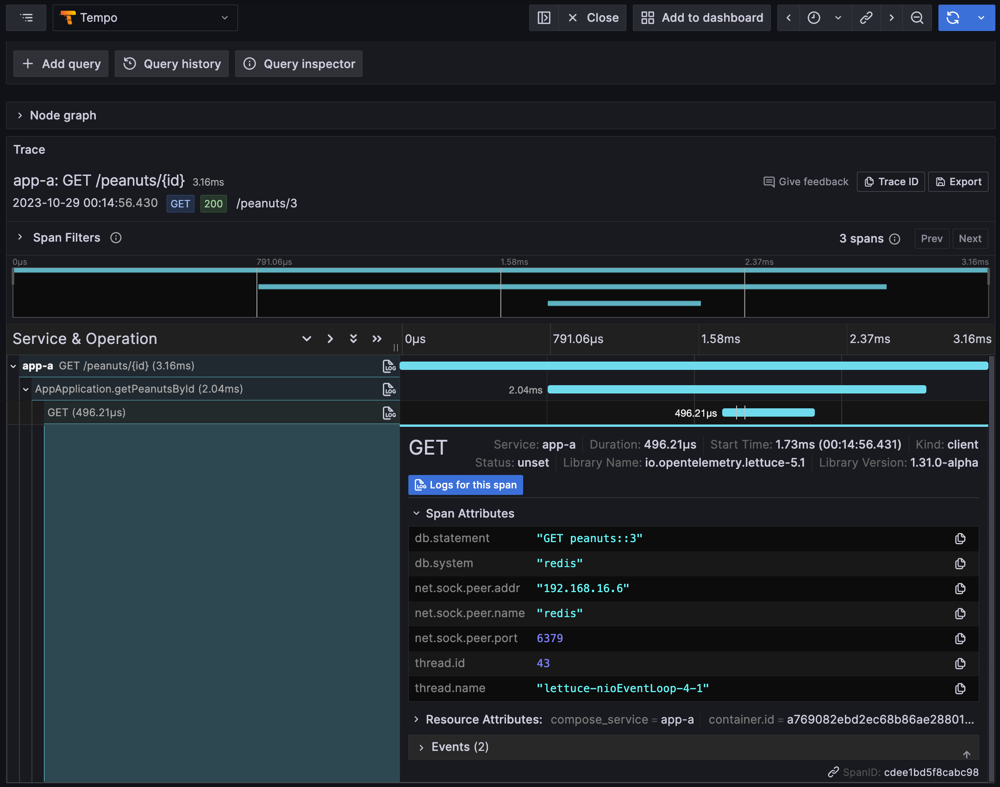
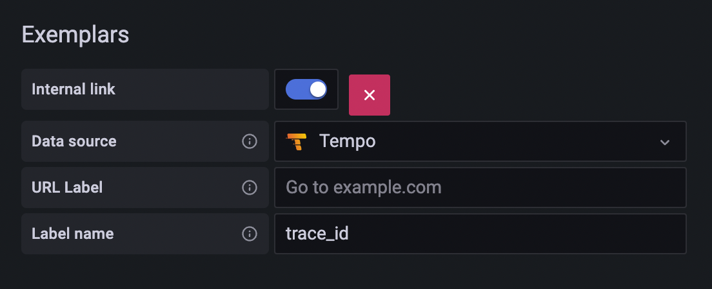
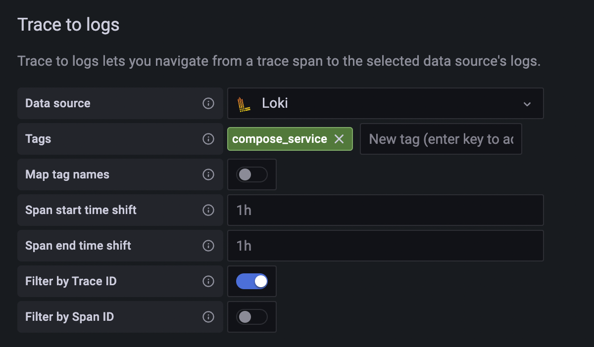
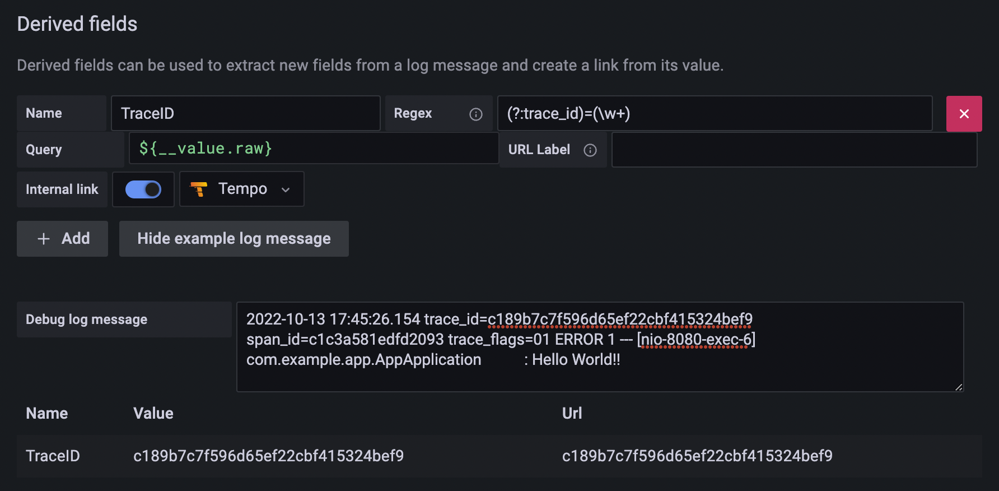

# Spring Boot com Observabilidade

Monitoramento de uma aplicação em Spring Boot com os três pilares da observabilidade no [Grafana](https://grafana.com/docs/grafana/latest/):

- Rastreamento com [Grafana Tempo](https://grafana.com/docs/tempo/latest/) e [OpenTelemetry para Java](https://opentelemetry.io/docs/languages/java/getting-started/)

- Métricas com [Prometheus](https://prometheus.io/), [Spring Boot Actuator](https://docs.spring.io/spring-boot/docs/current/actuator-api/htmlsingle/) e [Micrometer](https://micrometer.io/)

- Centralização de logs com [Grafana Loki](https://grafana.com/docs/loki/latest/) e [Logback](https://www.slf4j.org/manual.html)


## Indíce

- [Spring Boot com Observabilidade](#indíce)
  - [Inicialização rápida](#inicialização-rápida)
  - [Explorando o Grafana](#explorando-o-grafana)
    - [Métricas em Rastreamento](#métricas-em-rastreamento)
    - [Rastreamento em Logs](#rastreamento-em-logs)
    - [Logs em Rastreamento](#logs-em-rastreamento)

  - [Detalhes](#detalhes)
    - [Aplicação Spring Boot](#aplicação-spring-boot)
      - [Instrumentação com OpenTelemetry](#instrumentação-com-opentelemetry)
      - [Logs](#logs)
      - [Rastreamento](#rastreamento)
      - [Métricas](#métricas)
        - [Métricas com Exemplar](#métricas-com-exemplar)

    - [Prometheus - Métricas](#prometheus---métricas)
      - [Configuração do Prometheus](#configuração-do-prometheus)
      - [Transmitindo para o Grafana](#transmitindo-para-o-grafana)

    - [Grafana Tempo - Rastreamento](#grafana-tempo---rastreamento)
      - [Transmitindo para o Grafana](#transmitindo-para-o-grafana-1)

    - [Grafana Loki - Logs](#grafana-loki---logs)
      - [Driver do Docker](#driver-do-docker)
      - [Transmitindo para o Grafana](#transmitindo-para-o-grafana-2)
    - [Grafana](#grafana)
  - [Referências](#referências)

## Inicialização rápida

1. Instale o [plugin do Loki](https://grafana.com/docs/loki/latest/send-data/docker-driver/)

   ```bash
   docker plugin install grafana/loki-docker-driver:latest --alias loki --grant-all-permissions
   ```

2. Inicialize todos os contêineres

   ```bash
   docker compose up -d
   ```

3. Envie múltipla requisições com [siege](https://linux.die.net/man/1/siege) e curl para a aplicação

   ```bash
   sh scripts/tracing.sh
   sh scripts/requests.sh
   ```

   >**Dica**: se preferir, remova comentários na parte de configuração do container do [Grafana K6](https://k6.io/) no `docker-compose.yml` ou através do Swagger UI disponível na rota **`/swagger-ui/index.html`**

4. Acesse o Grafana através do endereço [localhost:3000](http://localhost:3000/) e vá até o painel `Spring Boot Observability`

>**Credenciais**: por padrão, o login e senha do Grafana é `admin`

   Captura de tela exemplar:

   

   >Este painel predefinido para aplicações em Spring Boot está disponível no [Marketplace de dashboards do Grafana](https://grafana.com/grafana/dashboards/17175).

## Explorando o Grafana

Grafana fornece uma grande solução, no qual podemos monitorar ações específicas em um serviço entre rastreamentos, métricas e logs através do ID de rastreamento.


Fonte da imagem: [Grafana](https://grafana.com/blog/2021/03/31/intro-to-exemplars-which-enable-grafana-tempos-distributed-tracing-at-massive-scale/)

### Métricas em Rastreamento

Obtenha o ID de rastreamento de um exemplo nas métricas, e então busque-a no Grafana Tempo.

Pesquise por ```histogram_quantile(.99,sum(rate(http_server_requests_seconds_bucket{application="app-a", uri!="/actuator/prometheus"}[1m])) by(uri, le))``` e converta em um exemplar nas opções.


### Rastreamento em logs

Obtenha o ID de rastreamento e tags (que é `compose.service`) definida na fonte de dados do Grafana Tempo, e então faça a busca no Grafana Loki.


### Logs em rastreamento

Obtenha o ID de rastreamento no log (RegExp estão habilitadas a partir da fonte de dados do Grafana Loki), e então pesquise através do Grafana Tempo.


## Detalhes

### Aplicação Spring Boot

Para um cenário mais complexo, usaremos estas aplicações em Spring Boot com o mesmo código nesta demonstração. Há uma ação de múltiplos serviços na rota `/chain`, na qual fornece um bom exemplo de como a instrumentação do OpenTelemtry funciona e como o Grafana apresenta essa informação para rastreamento.

#### Instrumentação com OpenTelemetry

[OpenTelemetry para Java](https://github.com/open-telemetry/opentelemetry-java-instrumentation) possui SDK para [instrumentação automática](https://opentelemetry.io/docs/instrumentation/java/automatic/):

```bash
java -javaagent:localização/do/opentelemetry-agent.jar -jar [nome da aplicação].jar
```

O agente suporta diversas [bibliotecas](https://github.com/open-telemetry/opentelemetry-java-instrumentation/blob/main/docs/supported-libraries.md), incluindo o Spring Web MVC. Segundo o documento traduzido do inglês:

> Pode ser usado para capturar dados de telemetria nos "limites" de uma aplicação ou serviço, tais como requisições de entrada, chamadas de saídas HTTP, chamadas ao banco de dados e muito mais

Então não precisamos modificar qualquer linha de código de nosso repositório. O agente se encarregará de tudo automaticamente. Neste projeto, temos três tipos de ações que podem ser capturadas pelo agente:

1. Requisições HTTP: captura informações HTTP tais como método da requisição, status e entre outros.

    

2. Ações do PostgreSQL (POST `/peanuts` e a primeira requisição do GET `/peanuts/{id}`): captura informação do banco de dados como a declaração em SQL, nome da tabela e muito mais.

    

3. Comandos do Redis(Da segunda requisição GET `/peanuts/{id}`): captura informação do Redis como comandos, chaves e outros detalhes.

    

As confurações como as do exportador, são listadas no [documento](https://github.com/open-telemetry/opentelemetry-java/tree/main/sdk-extensions/autoconfigure), e são utilizadas pelo agente a partir de um ou mais fontes seguintes (ordenadas da alta até a menor prioridade):

- Propriedades do sistema
- Variáveis de ambiente
- O arquivo de configuração
- O SPI do [ConfigPropertySource](https://github.com/open-telemetry/opentelemetry-java/tree/main/sdk-extensions/autoconfigure#customizing-the-opentelemetry-sdk)

Neste projeto de apresentação, usaremos variáveis de ambiente para definir as configurações do agente:

```yml
app-a:
  build: ./app/
  environment:
    - OTEL_EXPORTER_OTLP_ENDPOINT=http://tempo:4317
    - OTEL_SERVICE_NAME=app-a
    - OTEL_RESOURCE_ATTRIBUTES=compose_service=app-a
    - OTEL_METRICS_EXPORTER=none
  ports:
    - 8080:8080
```

Ou usando um arquivo de configuração, que é uma outra alternativa comum para configurar o agente:

```properties
# otel.properties
otel.exporter.otlp.endpoint=http://tempo:4317
otel.service.name=app-a
otel.resource.attributes=compose_service=app-a
otel.metrics.exporter=none
```

```bash
# Defina o "otel.javaagent.configuration-file" com as propriedades do sistema
java -javaagent:path/to/opentelemetry-javaagent.jar \
     -Dotel.javaagent.configuration-file=path/to/otel.properties \
     -jar myapp.jar
```

Para mais detalhes de configuração, consulte a [documentação oficial do OpenTelemetry](https://opentelemetry.io/docs/instrumentation/java/automatic/agent-config/).

#### Logs

O agente do OpenTelemetry adicionará informação automaticamente para cada log.

>Agente do OpenTelemtry injeta a informação atual em cada evento de log da cópia do MDC (Mapped Diagnostic Context):
>
> - **`trace_id`** - o atual ID de rastreamento (equivalente ao Span.current().getSpanContext().getTraceId());
> - **`span_id`** - o atual ID (equivalente a **`Span.current().getSpanContext().getSpanId());`**)
> - **`trace_flags`** - flags de rastreamento atual, formatada de acordo com as regras de traceflags da W3C (equivalente a **`Span.current().getSpanContext().getTraceFlags().asHex()`**).

Referências técnicas: [Instrumentação automática com Logger MDC](https://github.com/open-telemetry/opentelemetry-java-instrumentation/blob/main/docs/logger-mdc-instrumentation.md)

Neste projeto demonstrativo, trocamos o `logging.pattern.level` no arquivo `application.yaml`:

```yml
logging:
  pattern:
    level: "trace_id=%mdc{trace_id} span_id=%mdc{span_id} trace_flags=%mdc{trace_flags} %p"
```

O log terá sua saída neste formato:

```log
2022-10-10 15:18:54.893 trace_id=605c7adf03bdb2f2917206de1eae8f72 span_id=c581b882e2d252c2 trace_flags=01 ERROR 1 --- [nio-8080-exec-6] com.example.app.AppApplication           : Olá Java!
```

#### Rastreamento

Como mencionado anteriromente, o agente do OpenTelemtry captura dados nos "limites" de uma aplicação ou serviço, como requisições de entradas e saída de chamadas HTTP. Não necessitamos de adicionar nada no código. Para demonstrar, providenciamos a rota `/chain` na aplicação a seguir:

```java
@GetMapping("/chain")
public String chain() throws InterruptedException, IOException {
  String TARGET_ONE_HOST = System.getenv().getOrDefault("TARGET_ONE_HOST", "localhost");
  String TARGET_TWO_HOST = System.getenv().getOrDefault("TARGET_TWO_HOST", "localhost");
  logger.debug("Cadeia inicializando ...");
  Request.Get("http://localhost:8080/").execute().returnContent();
  Request.Get(String.format("http://%s:8080/io_task", TARGET_ONE_HOST)).execute().returnContent();
  Request.Get(String.format("http://%s:8080/cpu_task", TARGET_TWO_HOST)).execute().returnContent();
  logger.debug("Cadeia encerrada");
  return "chain";
}
```

Ao acessar a rota `chain` do container `app-a`, irá enviar requisições para sua própria rota base (`/`) e outros dois serviços como o `io_task` e `cpu_task` em ordem. No processo todo, não digitamos nenhuma linha de código do OpenTelemetry, rastreamento ou até mesmo operação da aplicação. Mas o log mostra todas as requisições recebidas e saídas de chamada HTTP adicionadas a informação de operação a seguir:

```log
# Start from app-a chain
2022-10-10 15:57:12.828 trace_id=743ae05db90d00fd65998ff30cf7094d span_id=6cc84ac5ed4cf68c trace_flags=01 DEBUG 1 --- [nio-8080-exec-6] com.example.app.AppApplication           : Cadeia inicializando ...

# In app-a root
2022-10-10 15:57:13.106 trace_id=743ae05db90d00fd65998ff30cf7094d span_id=4745d1a1f588a949 trace_flags=01 ERROR 1 --- [nio-8080-exec-7] com.example.app.AppApplication           : [traceparent:"00-743ae05db90d00fd65998ff30cf7094d-d72a1422522ce837-01", host:"localhost:8080", connection:"Keep-Alive", user-agent:"Apache-HttpClient/4.5.13 (Java/1.8.0_342)", accept-encoding:"gzip,deflate"]
2022-10-10 15:57:13.106 trace_id=743ae05db90d00fd65998ff30cf7094d span_id=4745d1a1f588a949 trace_flags=01 ERROR 1 --- [nio-8080-exec-7] com.example.app.AppApplication           : Olá Java!
2022-10-10 15:57:13.106 trace_id=743ae05db90d00fd65998ff30cf7094d span_id=4745d1a1f588a949 trace_flags=01 DEBUG 1 --- [nio-8080-exec-7] com.example.app.AppApplication           : Log de depuração
2022-10-10 15:57:13.106 trace_id=743ae05db90d00fd65998ff30cf7094d span_id=4745d1a1f588a949 trace_flags=01 INFO 1 --- [nio-8080-exec-7] com.example.app.AppApplication           : Log de informação
2022-10-10 15:57:13.106 trace_id=743ae05db90d00fd65998ff30cf7094d span_id=4745d1a1f588a949 trace_flags=01 WARN 1 --- [nio-8080-exec-7] com.example.app.AppApplication           : Log de aviso!
2022-10-10 15:57:13.106 trace_id=743ae05db90d00fd65998ff30cf7094d span_id=4745d1a1f588a949 trace_flags=01 ERROR 1 --- [nio-8080-exec-7] com.example.app.AppApplication           : Log de erro

# In app-b io_task
2022-10-10 15:57:14.141 trace_id=743ae05db90d00fd65998ff30cf7094d span_id=b97df0b1834ab84a trace_flags=01 INFO 1 --- [nio-8080-exec-4] com.example.app.AppApplication           : Tarefa I/O

# In app-c cpu_task
2022-10-10 15:57:14.191 trace_id=743ae05db90d00fd65998ff30cf7094d span_id=7fd693eefc0d3387 trace_flags=01 INFO 1 --- [nio-8080-exec-4] com.example.app.AppApplication           : Tarefa da CPU

# Back to app-a chain
2022-10-10 15:57:14.199 trace_id=743ae05db90d00fd65998ff30cf7094d span_id=6cc84ac5ed4cf68c trace_flags=01 DEBUG 1 --- [nio-8080-exec-6] com.example.app.AppApplication           : Cadeia encerrada
```

Cada rota possui a mesma propriedade **trace_id** como `743ae05db90d00fd65998ff30cf7094d` inicializando a partir do container `app-a` na rota `chain`. A auto-injeção do `traceparent` (pode ser vista na primeira linha nos logs do container `app-a`) é como o agnete do OpenTelemetry transmite através destes serviços

Each endpoint got the same trace_id `743ae05db90d00fd65998ff30cf7094d` start from app-a `chain`. The auto-injected `traceparent`(could saw in the first line in app-a root log) is how OpenTelemetry Agent passed through all these services.

#### Métricas

Para obter as métricas do Prometheus vindas da aplicação, precisamos de duas dependências:

1. [Spring Boot Actuator](https://github.com/spring-projects/spring-boot/tree/v2.7.4/spring-boot-project/spring-boot-actuator):
O Actuator fornece muitas funcionalidades para monitoramente por HTTP ou rotas JMX para aplicações em Spring Boot.
2. [Micrometer](https://github.com/micrometer-metrics/micrometer):
Micrometer fornece uma API geral para coletar métricas e transforma o formato para diferentes sistemas de monitoramento, incluindo o Prometheus.

Adicione estas duas dependências para o arquivo `pom.xml` e configuração para o `application.yaml` conforme o exemplo abaixo:

```xml
<!-- pom.xml -->

<dependency>
   <groupId>org.springframework.boot</groupId>
   <artifactId>spring-boot-starter-actuator</artifactId>
</dependency>
<dependency>
   <groupId>io.micrometer</groupId>
   <artifactId>micrometer-registry-prometheus</artifactId>
</dependency>
```

```yml
# application.yaml

management:
  endpoints:
    web:
      exposure:
        include: prometheus # Apenas para exposição da rota "/actuator/prometheus"

  metrics:
    tags:
      application: app # Adicione uma tag para cada métrica do Prometheus
```

Métricas do Prometheus parecerão como isto na rota `/actuator/prometheus`:

```txt
# HELP executor_active_threads The approximate number of threads that are actively executing tasks
# TYPE executor_active_threads gauge
executor_active_threads{application="app",name="applicationTaskExecutor",} 0.0
[...]

 HELP http_server_requests_seconds Duration of HTTP server request handling
# TYPE http_server_requests_seconds summary
http_server_requests_seconds_count{application="app",exception="None",method="GET",outcome="SUCCESS",status="200",uri="/",} 1.0
http_server_requests_seconds_sum{application="app",exception="None",method="GET",outcome="SUCCESS",status="200",uri="/",} 0.047062542
http_server_requests_seconds_count{application="app",exception="None",method="GET",outcome="SUCCESS",status="200",uri="/actuator/prometheus",} 2.0
http_server_requests_seconds_sum{application="app",exception="None",method="GET",outcome="SUCCESS",status="200",uri="/actuator/prometheus",} 0.053801375
# HELP http_server_requests_seconds_max Duration of HTTP server request handling
# TYPE http_server_requests_seconds_max gauge
http_server_requests_seconds_max{application="app",exception="None",method="GET",outcome="SUCCESS",status="200",uri="/",} 0.047062542
http_server_requests_seconds_max{application="app",exception="None",method="GET",outcome="SUCCESS",status="200",uri="/actuator/prometheus",} 0.045745625

[...]
```

##### Métricas com Exemplar

Exemplar é um novo tipo de dado proposto no [OpenMetrics](https://github.com/OpenObservability/OpenMetrics/blob/main/specification/OpenMetrics.md#exemplars). Para habilitar a funcionalidade do Exemplar, há alguns requisitos de dependências:

1. Spring Boot em versão igual ou superior a **`2.7.0`**: Spring Boot suporta o Exemplar do Prometheus desde a versão [v2.7.0-RC1](https://github.com/spring-projects/spring-boot/releases/tag/v2.7.0-RC1).
2. Micrometer em versão igual ou superior a **`1.10.0`**: Micrometer suporta Exemplar para o Histogramas e Contadores do Prometheus desde a versão [1.9.0](https://github.com/micrometer-metrics/micrometer/releases/tag/v1.9.0) e usando `io.prometheus.simpleclient_common` em versão 0.16.0 desde a versão [1.10.0](https://mvnrepository.com/artifact/io.micrometer/micrometer-registry-prometheus/1.10.0).

Além disso, necessitaremos de adicionar uma amostra do Exemplar [Exemplar Sampler](app/src/main/java/com/example/app/PrometheusExemplarSamplerConfiguration.java) (Fonte: [qaware/cloud-observability-grafana-spring-boot](https://github.com/qaware/cloud-observability-grafana-spring-boot/blob/b331b87b1a7f0f5b5d57150e0356e6a26af967a2/spring-boot-app/src/main/java/de/qaware/demo/cloudobservability/PrometheusExemplarSamplerConfiguration.java)) como mostra a seguir:

```java
package com.example.app;

import io.prometheus.client.exemplars.tracer.otel_agent.OpenTelemetryAgentSpanContextSupplier;
import org.springframework.context.annotation.Bean;
import org.springframework.context.annotation.Configuration;

@Configuration
public class PrometheusExemplarSamplerConfiguration {
  @Bean
  public OpenTelemetryAgentSpanContextSupplier openTelemetryAgentSpanContextSupplier() {
    return new OpenTelemetryAgentSpanContextSupplier();
  }
}
```

A dicussão sobre uma amostra do Exemplar está em [Suporte de Exemplares para o Histograma do Prometheus #2812](https://github.com/micrometer-metrics/micrometer/issues/2812#issuecomment-1086001766) no repositório do Micrometer.

Quando todas as dependências estiverem adicionadas, podemos adicionar distribuição de métrica para o Prometheus no arquivo `application.yaml`.

```yml
management:
  metrics:
    distribution:
      percentiles-histogram:
        http:
          server:
            requests: 'true'
```

Verifique por mais opções de distribuição de métricas na [documentação oficial do Spring Boot](https://docs.spring.io/spring-boot/docs/2.7.3/reference/html/actuator.html#actuator.metrics.customizing.per-meter-properties).

Como mencionado anteriormente, Exemplar é um novo tipo de dado proposto no OpenMetrics e o padrão da rota `/actuator/prometheus` para fornecer métricas com o formato do Prometheus. Então necessitamos adicionar alguns [cabeçalhos](https://docs.spring.io/spring-boot/docs/current/actuator-api/htmlsingle/#prometheus.retrieving:~:text=The%20default%20response%20content%20type%20is%20text/plain%3Bversion%3D0.0.4.%20The%20endpoint%20can%20also%20produce%20application/openmetrics%2Dtext%3Bversion%3D1.0.0%20when%20called%20with%20an%20appropriate%20Accept%20header%2C%20as%20shown%20in%20the%20following%20curl%2Dbased%20example%3A) para obter as métricas com o formato do OpenMetrics como mostrar a seguir:

```bash
curl 'http://localhost:8080/actuator/prometheus' -i -X GET \
   -H 'Accept: application/openmetrics-text; version=1.0.0; charset=utf-8'
```

As métricas do histograma com ID de rastreamento (que começam com `#`), irão parecer como isto:

```txt
# TYPE http_server_requests_seconds histogram
# HELP http_server_requests_seconds Duration of HTTP server request handling
http_server_requests_seconds_bucket{application="app",exception="None",method="GET",outcome="SUCCESS",status="200",uri="/",le="0.001"} 0.0
http_server_requests_seconds_bucket{application="app",exception="None",method="GET",outcome="SUCCESS",status="200",uri="/",le="0.001048576"} 0.0
http_server_requests_seconds_bucket{application="app",exception="None",method="GET",outcome="SUCCESS",status="200",uri="/",le="0.001398101"} 0.0
http_server_requests_seconds_bucket{application="app",exception="None",method="GET",outcome="SUCCESS",status="200",uri="/",le="0.001747626"} 0.0
http_server_requests_seconds_bucket{application="app",exception="None",method="GET",outcome="SUCCESS",status="200",uri="/",le="0.002097151"} 0.0
http_server_requests_seconds_bucket{application="app",exception="None",method="GET",outcome="SUCCESS",status="200",uri="/",le="0.002446676"} 0.0
http_server_requests_seconds_bucket{application="app",exception="None",method="GET",outcome="SUCCESS",status="200",uri="/",le="0.002796201"} 1.0 # {span_id="55255da260e873d9",trace_id="21933703cb442151b1cef583714eb42e"} 0.002745959 1665676383.654
http_server_requests_seconds_bucket{application="app",exception="None",method="GET",outcome="SUCCESS",status="200",uri="/",le="0.003145726"} 1.0
http_server_requests_seconds_bucket{application="app",exception="None",method="GET",outcome="SUCCESS",status="200",uri="/",le="0.003495251"} 2.0 # {span_id="81222a08c4f050fe",trace_id="eddcd9569d20b4aa48c06d3b905f32ea"} 0.003224625 1665676382.620
```

### Prometheus - Métricas

Coleta métricas das aplicações

#### Configuração do Prometheus

Defina todo o rascunho/scrape de métricas de todas as aplicações no arquivo localizado em `./configs/prometheus/prometheus.yml`.

Prometheus irá extrair automaticamente o formato de métricas do OpenMetrics, e não há necessidade de adicionar configuração especifica de cabeçalhos quando extraindo da rota `/actuator/prometheus`.

```yml
# [...]
scrape_configs:
  - job_name: 'app-a'
    scrape_interval: 5s
    metrics_path: "/actuator/prometheus"
    static_configs:
      - targets: ['app-a:8080']

  - job_name: 'app-b'
    scrape_interval: 5s
    metrics_path: "/actuator/prometheus"
    static_configs:
      - targets: ['app-b:8080']

  - job_name: 'app-c'
    scrape_interval: 5s
    metrics_path: "/actuator/prometheus"
    static_configs:
      - targets: ['app-c:8080']
```

#### Transmitindo para o Grafana

Adicione um Exemplar no qual usa o valor do rótulo `TraceID` para vincular ao Grafana Tempo.

Exemplo de configuração de transmissão de dados ao Grafana:



Exemplo de configuração predefinida de fonte de dados do Grafana:

```yaml
name: Prometheus
type: prometheus
typeName: Prometheus
access: proxy
url: http://prometheus:9090
password: ''
user: ''
database: ''
basicAuth: false
isDefault: true
jsonData:
exemplarTraceIdDestinations:
  - datasourceUid: tempo
    name: TraceID
httpMethod: POST
readOnly: false
editable: true
```

### Grafana Tempo - Rastreamento

Receptor de operações das aplicações

#### Transmitindo para o Grafana

Configuração de [rastreamento em logs](https://grafana.com/docs/grafana/latest/datasources/tempo/#trace-to-logs):

1. Fonte de dados: fonte do log alvo.
2. Tags: Chave de tags ou atributos em nível de processo vindo do rastreamento, no qual irá ser o critério de busca de log se a chave existir no rastreamento.

3. Mapeamento de nomes de tag: converte uma chave existente de tags ou atributos em nível de processo do rastreamento para outra chave, e então usado como critério de busca de log. Use esta funcionalidade quando os valores de tag de rastreamento e rótulo do log são idênticos mas com chaves diferentes.

Exemplo de configuração predefinida de fonte de dados para o Grafana:



Exemplo de configuração de fonte de dados do Grafana:

```yaml
name: Tempo
type: tempo
typeName: Tempo
access: proxy
url: http://tempo:4137
password: ''
user: ''
database: ''
basicAuth: false
isDefault: false
jsonData:
nodeGraph:
   enabled: true
tracesToLogs:
   datasourceUid: loki
   filterBySpanID: false
   filterByTraceID: true
   mapTagNamesEnabled: false
   tags:
      - compose_service
readOnly: false
editable: true
```

### Grafana Loki - Logs

Centralizador de logs com o plugin do Docker de todos os serviços.

#### Driver do Docker

1. Use a funcionalidade de [ancoramento e apelidação no YAML](https://support.atlassian.com/bitbucket-cloud/docs/yaml-anchors/) para definir opções de log em cada serviço.
2. Defina as [opções do driver do Grafana Loki no Docker](https://grafana.com/docs/loki/latest/send-data/docker-driver/configuration/)
   1. loki-url: endereço do Grafana Loki
   2. loki-pipeline-stages: processa múltiplas linhas de log da aplicação com estágios de múltiplas linhas de RegExp ([referência](https://grafana.com/docs/loki/latest/send-data/promtail/stages/multiline/))

```yml
version: '3.8'

x-logging: &default-logging # ancôra(&): 'default-logging' que define um pedaço/parte (chunk) da configuração
  driver: loki
  options:
    loki-url: http://localhost:3100/api/prom/push
    loki-pipeline-stages: |
      - multiline:
          firstline: '^\d{4}-\d{2}-\d{2} \d{1,2}:\d{2}:\d{2}'
          max_wait_time: 3s
      - regex:
          expression: '^(?P<time>\d{4}-\d{2}-\d{2} \d{1,2}:\d{2}:\d{2},d{3}) (?P<message>(?s:.*))$$'
# Use os caracteres $$ (símbolo do dólar) quando sua configuração necessita de um símbolo literal do dólar.

services:
  container-1:
    image: nginx:latest
    logging: *default-logging # apelido(*): refere-se a parte chamada 'default-logging' 
```

#### Transmitindo para o Grafana

Adiciona um ID de rastreamento derivado do campo para extrair o ID e vincular ao Grafana Tempo a partir deste mesmo ID.

Configuração exemplar de fonte de dados do Grafana Tempo:



Exemplo de configuração predefinida do Grafana Tempo:

```yml
name: Loki
type: loki
typeName: Loki
access: proxy
url: http://loki:3100
password: ''
user: ''
database: ''
basicAuth: false
isDefault: false
jsonData:
derivedFields:
   - datasourceUid: tempo
      matcherRegex: (?:trace_id)=(\w+)
      name: TraceID
      url: $${__value.raw}
      # Use os caracteres $$ (símbolo do dólar) quando sua configuração necessita de um símbolo literal do dólar.
readOnly: false
editable: true
```

### Grafana

1. Adicione o Prometheus, Tempo e Loki para a fonte de dados com o arquivo de configuração no caminho `./configs/grafana/datasource.yml`.

2. Carregue um painel predefinido a partir dos arquivos localizados em `.configs/grafana/dashboards.yaml` e também `./configs/grafana/dashboards/spring-boot-observability.json`

```yml
# Configuração individual do container do Grafana no docker-compose.yml

  grafana:
    container_name: grafana
    build: ./configs/grafana/
    user: root
    ports:
      - 3000:3000
    volumes:
      - ./configs/grafana/datasource.yml:/usr/share/grafana/conf/provisioning/datasources/datasources.yml # Fonte de dados
      - ./configs/grafana/dashboards.yml:/usr/share/grafana/conf/provisioning/dashboards/dashboards.yml # Configurações do painel
      - ./configs/grafana/dashboards:/usr/share/grafana/dashboards # Diretório de arquivos JSON de painéis
```

## Referências

1. [Repositório base](https://github.com/blueswen/spring-boot-observability)
2. [Suporte de Histograma do Prometheus para Exemplar](https://github.com/micrometer-metrics/micrometer/issues/2812)
3. [Auto-configuração do SDK do OpenTelemetry](https://github.com/open-telemetry/opentelemetry-java/blob/main/sdk-extensions/autoconfigure/README.md)
4. [Propriedades sistêmicas e variáveis de ambiente do Java](https://stackoverflow.com/questions/7054972/java-system-properties-and-environment-variables)
